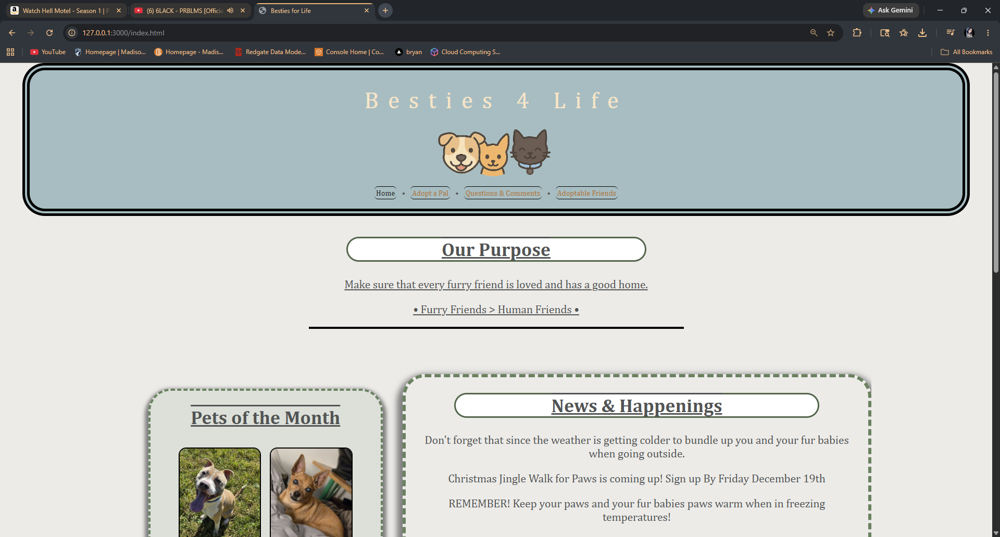

# Maipa's Portfolio Website

## About
Personal portfolio website built with HTML and CSS to showcase web development, AWS cloud projects, APIs, and database projects.

## Technologies Used
- HTML
- CSS
- GitHub
- VS Code

## Features
- Dark themed custom UI
- Responsive project cards
- External GitHub project links
- Skills section
- Personal branding and portfolio layout

## What I Learned
- Website structure and layout
- CSS styling and hover effects
- Portfolio design
- Project organization
- GitHub repository management

## Screenshots

### Homepage

### About Section

### Furry Friends Page

### Adoption Forms Page

## Author
Maipa Ly
